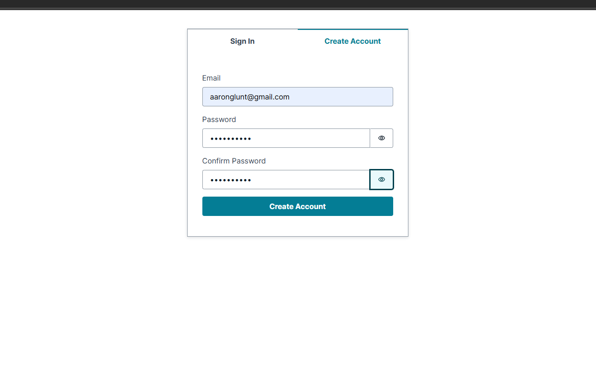
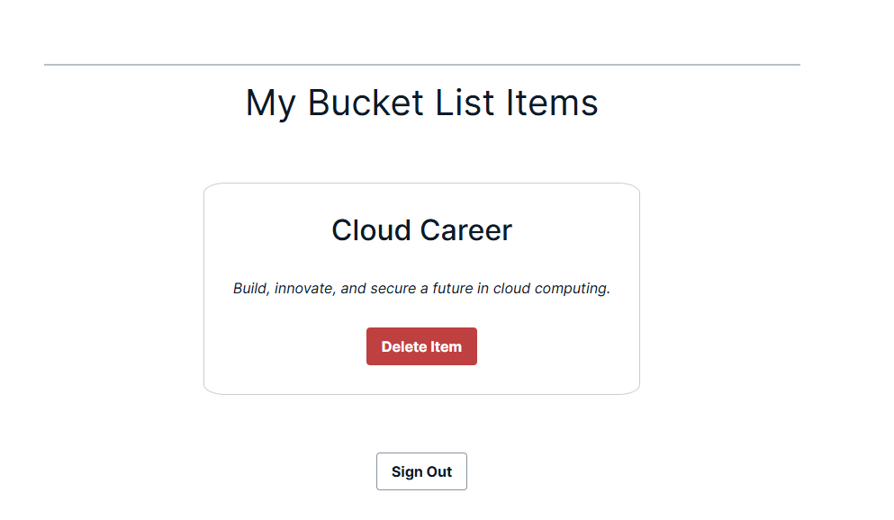

# React + Vite

This template provides a minimal setup to get React working in Vite with HMR and some ESLint rules.

Currently, two official plugins are available:

- [@vitejs/plugin-react](https://github.com/vitejs/vite-plugin-react/blob/main/packages/plugin-react) uses [Babel](https://babeljs.io/) for Fast Refresh
- [@vitejs/plugin-react-swc](https://github.com/vitejs/vite-plugin-react/blob/main/packages/plugin-react-swc) uses [SWC](https://swc.rs/) for Fast Refresh

## Expanding the ESLint configuration

If you are developing a production application, we recommend using TypeScript with type-aware lint rules enabled. Check out the [TS template](https://github.com/vitejs/vite/tree/main/packages/create-vite/template-react-ts) for information on how to integrate TypeScript and [`typescript-eslint`](https://typescript-eslint.io) in your project.


# Bucket List Tracker  

## 🌟 Project Overview  
This project was an exciting learning experience, filled with challenges and breakthroughs. The goal was to **build and deploy a bucket list tracker using AWS Amplify and React** while learning cloud development.  

## 🔥 My Journey & Struggles  
Building this app wasn’t straightforward—I encountered hurdles along the way, but persistence paid off. Here’s the corrected sequence of events based on my learning process:  

### 1️⃣ **Using React for the First Time**  
Starting fresh, I built the frontend using **React**, getting familiar with components, state management, and UI design.  


### 2️⃣ **Setting Up AWS Amplify**  
- Installed **Amplify CLI** and initialized the project.  
- Amplify had to **update all JS and configurations**, ensuring everything was structured correctly before moving forward.  
- Connected the project to **GitHub** to enable version control and continuous deployment.

  


### 3️⃣ **Configuring AWS IAM & Storage**  
- Added **IAM roles** for proper user permissions.  
- Set up **storage resources** within Amplify for managing data.


  

### 4️⃣ **Sandbox Issues & Fixes**  
- Opened the **Amplify sandbox** to test configurations before full deployment.  
- **Mistakenly closed it**, causing unexpected issues.  
- Learned that I needed to **keep it running** while executing commands in another terminal.


### 5️⃣ **Setting Up Access & Authentication**  
- **Created AWS Access Keys** for authentication.  
- Struggled with **Amplify Auth** setup, ensuring proper security configurations.  
- Adjusted TypeScript settings, making it **more private** with JavaScript changes.


   

### 6️⃣ **Creating a User & Deploying Amplify**  
- Set up a **user authentication flow** within Amplify.  
- Deployed the Amplify project, verifying backend configurations.


 

### 7️⃣ **Final GitHub Integration & Deployment**  
- Fully connected the **GitHub repository** with Amplify.  
- Installed Amplify hosting and pushed code updates.  
- Verified that everything was running correctly, leading to a **successful deployment**!








## 🎉 Shoutout to TechWithLucy  
A massive **thank you to TechWithLucy**, whose tutorial helped me navigate some of the toughest parts of this process. Without their guidance, I would’ve been stuck for a lot longer!  

## 🛠 Technologies Used  
- **React** (Frontend)  
- **AWS Amplify** (Backend + Hosting)  
- **GitHub Actions** (CI/CD)  
- **IAM & S3** (Storage & Authentication)  

## 🔧 How to Run This Project  
### 1️⃣ Clone the Repository  
```sh
git clone https://github.com/AaronG-Engineer/bucketlistapp.git  
cd bucketlistapp  
